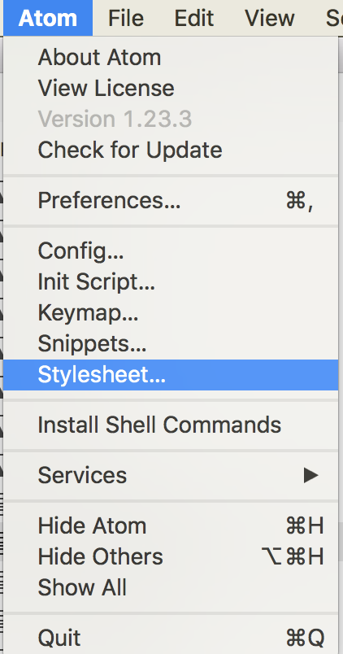

아톰에서 테마를  
```
UI Theme: One Light  
Syntax Theme: Atom Light  
```
로 쓰고 있었는데 초록색과 검정색을 구분하기 어려웠다. styles.less 를 변경하면 스타일을 바꿀 수 있다는 것을 알게되어 적용했다.



위 이미지의 메뉴를 클릭하면 수정가능. 코드는 [여기](https://github.com/centell/personal_settings/blob/master/atom/styles.less) 에 올려놨다.


